---
# 🖥️ EMR-Suite Frontend
---
**Role-Based Angular Frontend for a Production-Grade Electronic Medical Records (EMR) System**


---
# 🎥 Live Demo & Walkthrough

🎥 **System Walkthrough (6–12 mins)**  
▶️ (https://www.loom.com/share/eefaf3b4384a48338490bd6e730d9be2)[https://loom.com/share/eefaf3b4384a48338490bd6e730d9be2]

🌍 **Live Application (Frontend)**  
- <a href="https://emr.busade.dev" target="_blank" rel="noopener noreferrer">Live Application (Frontend)</a>


🌍 **Live Backend API (Swagger Docs)**  
- [https://emrapi.busade.dev/api/docs](https://emrapi.busade.dev/api/docs)


## 🧪 End-to-End Clinical Workflow (Role + Emergency + Governance)

### 1. Receptionist
- Register patient
- Schedule appointment → enters system queue

### 2. Nurse
- Capture vitals (triage)
- Data becomes instantly available in clinical timeline

### 3. Doctor
- Review vitals + history
- Create **SOAP clinical note**
- Record becomes immutable medical history

### 4. 🚨 Break-the-Glass (BTG)
- Request emergency access
- Provide justification
- Receive **time-bound privileged access**

System enforces:
- Full audit logging
- Live activity tracking
- Automatic expiry

### 5. Super Admin (Governance)
- Approve / Reject BTG requests
- Revoke active sessions
- Monitor audit logs
- Manage RBAC + PBAC matrix (users and roles)

> **Key Insight:** Separation of duties is enforced across Doctor, Admin, and Super Admin roles.

---

## 🔐 What This Demonstrates

- Real hospital **emergency access model (BTG)**
- Compliance-grade **auditability**
- Time-bound privileged escalation
- Enterprise-level **access governance**

---

# 🧠 Overview

**EMR-Suite Frontend** is a role-driven Angular application that models real hospital workflows with enterprise-grade architecture, security, and interoperability.

> ⚠️ This is NOT a CRUD dashboard — it is a **clinical operations system UI**.

### Covers:
- Patient lifecycle
- Clinical documentation (SOAP)
- Vitals / triage workflow
- Appointment system
- Billing operations
- Emergency access (BTG)
- FHIR-ready data layer

---

# ⭐ Key Highlights

- Role-based UI orchestration (Doctor, Nurse, Admin, Receptionist, Patient)
- Backend-driven **RBAC + PBAC**
- Real-time clinical workflow simulation
- Secure JWT + refresh flow
- FHIR-ready architecture
- DDD-aligned frontend structure

---

# 🏥 Core Healthcare Features

### 🔐 Authentication
- JWT-based login
- Session persistence
- Token refresh handling

### 🛡️ RBAC
- Role-driven UI rendering

### 🔑 PBAC
- Fine-grained permission enforcement

### 🧍 Patient Management
- Registration + lifecycle tracking

### 🩺 Clinical Notes (SOAP)
- Structured medical documentation
- Immutable records

### 💉 Vitals
- Nurse triage system
- Real-time updates

### 📅 Appointments
- Full scheduling lifecycle

### 💳 Billing
- Invoice + payment tracking

### 🚨 BTG
- Emergency override system
- Fully audited + time-bound

---

# 📸 System Screenshots

## 🔐 Authentication & Role-Based Access

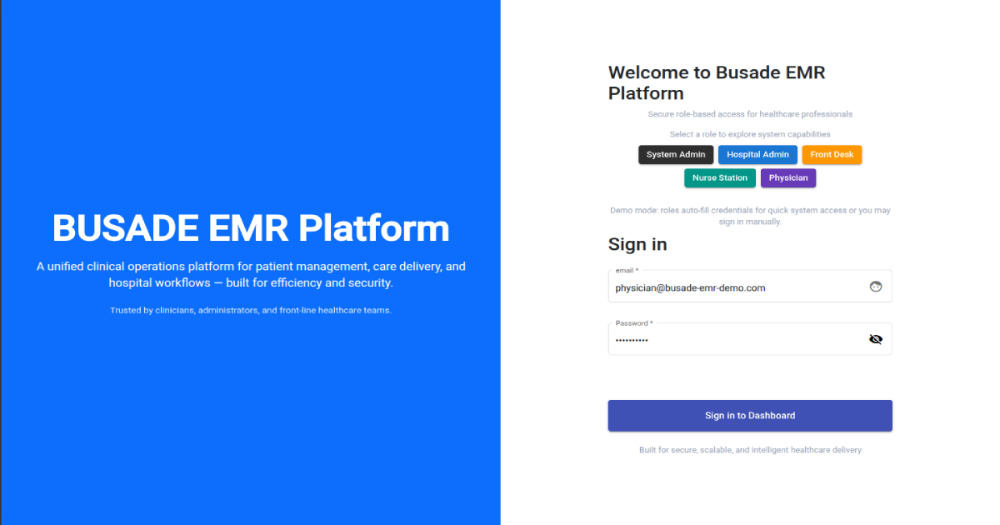

Secure authentication with role-based access control.
Quick role switching enables instant simulation of different user experiences across the system.

---

## 🧑‍💼 Front Desk — Patient Registration

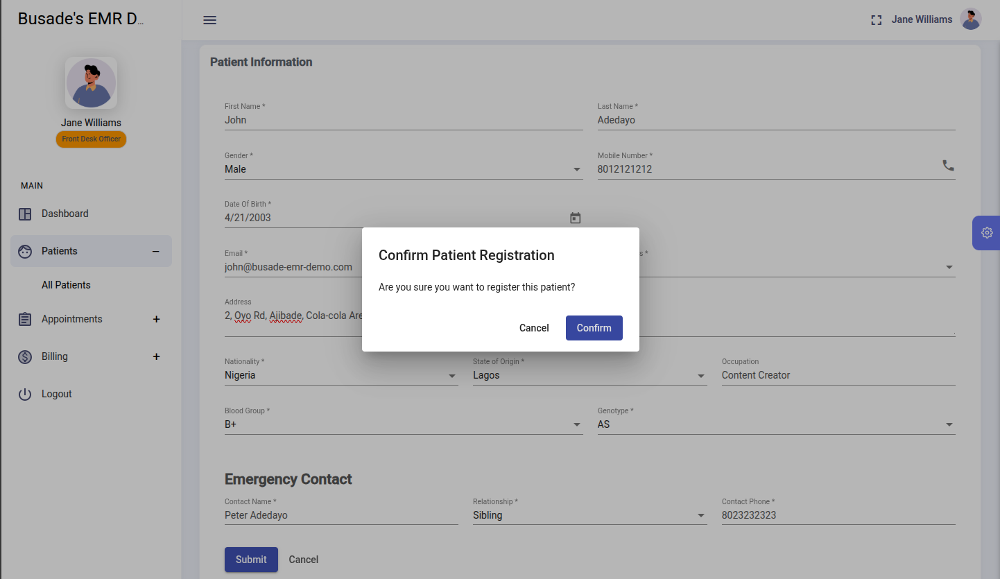

Front desk staff onboard new patients into the system, capturing essential demographic and identification data required for clinical workflows.

---

## 📅 Front Desk — Appointment Scheduling

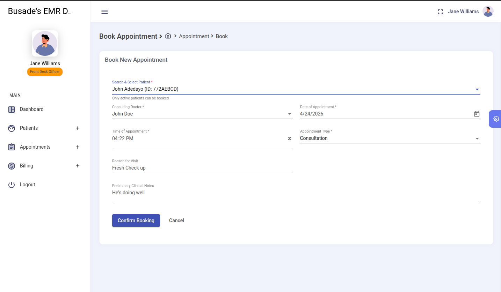

Patients are scheduled for visits, linking them to physicians and time slots.
This step initiates the clinical workflow and feeds into the care delivery pipeline.

---
## 🩺 Nurse - Awaiting Vital Signs (Today’s Clinic Queue)

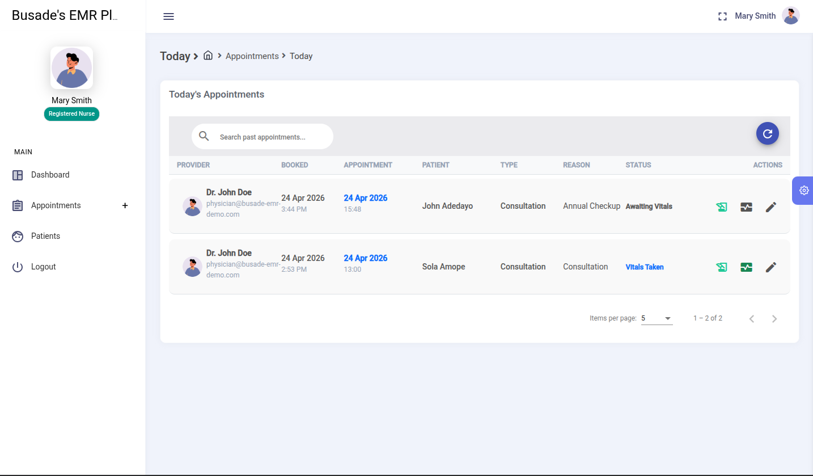

Patients scheduled for today who have been checked in and are currently awaiting vital sign capture by the nursing team.

These patients have not yet had their vitals recorded, and therefore are not yet eligible for triage or clinical consultation.

Once vital signs are captured, the patient record will automatically move to the “Ready for Triage” stage for physician review.
---

## 🩺 Nurse — Vitals & Triage

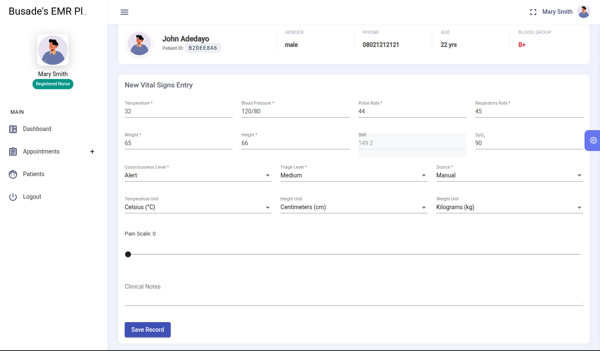

Nurses capture vital signs and triage data.
This information becomes immediately available to physicians for clinical decision-making.

---
## 👨‍⚕️ Physician — Today’s Appointments (Consultation Queue)
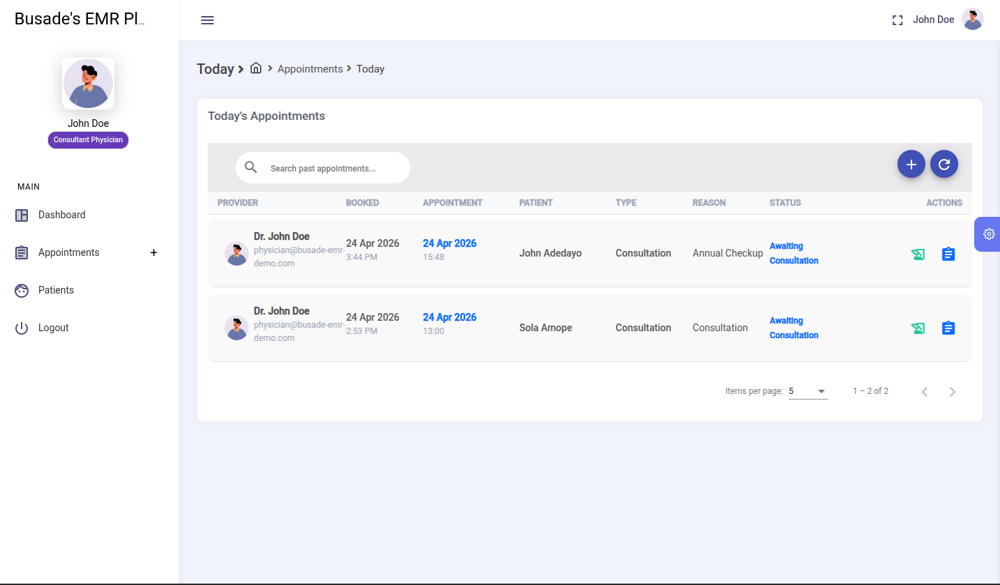

Physicians view their scheduled patients for the day with real-time status tracking.  
Patients marked as *Awaiting Consultation* are ready to be seen, ensuring a smooth clinical workflow transition from triage to consultation.

---

## 👨‍⚕️ Physician — Clinical Documentation (SOAP)

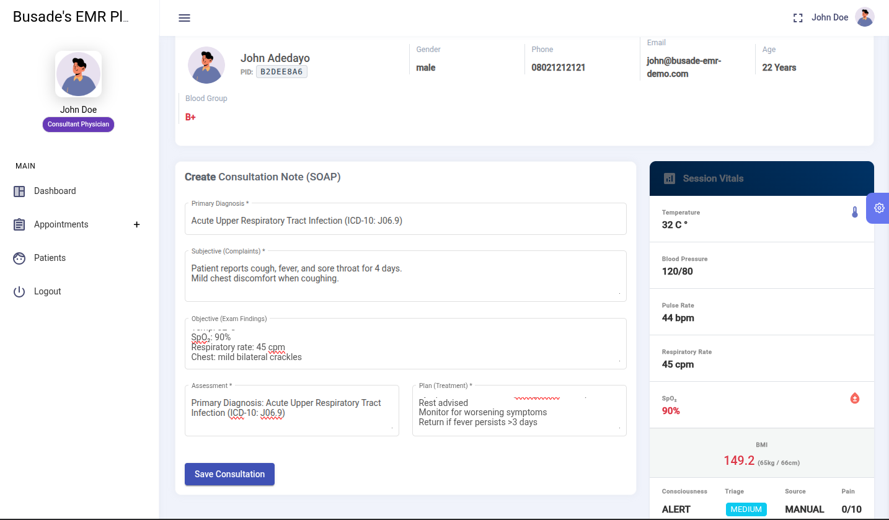

Physicians document patient encounters using structured SOAP notes.
Records are persisted as part of the patient’s longitudinal medical history.

---
## 🚨 Emergency Access (Break-the-Glass)

### 🔒 Nurse - Restricted Clinical Access + Break-the-Glass Request
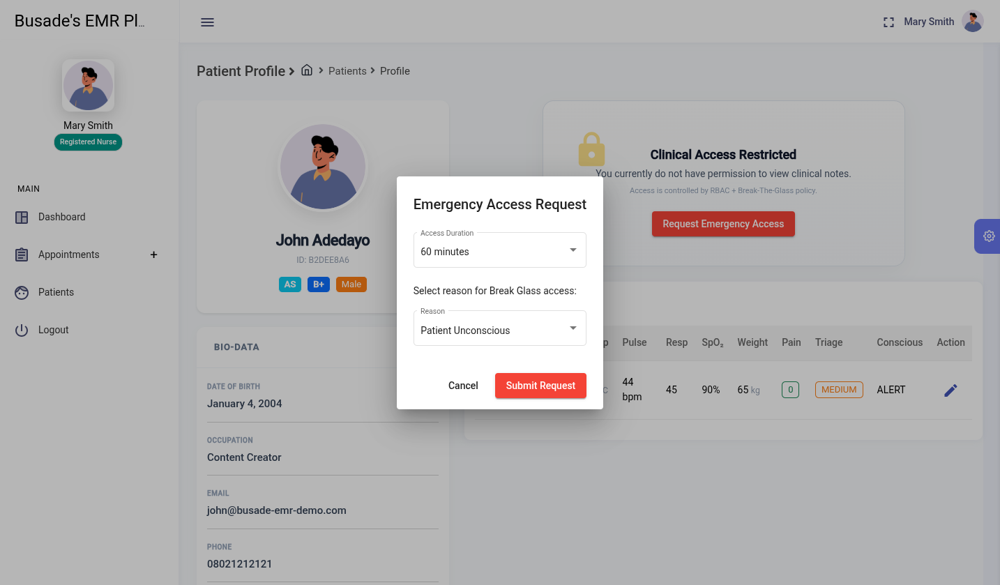

Clinical records are protected by default access control policies.
Implements a controlled emergency access mechanism.
Nurses can request temporary elevated privileges with full audit logging and automatic expiry for compliance.

---

### 🧑‍⚖️ Admin Approval Workflow
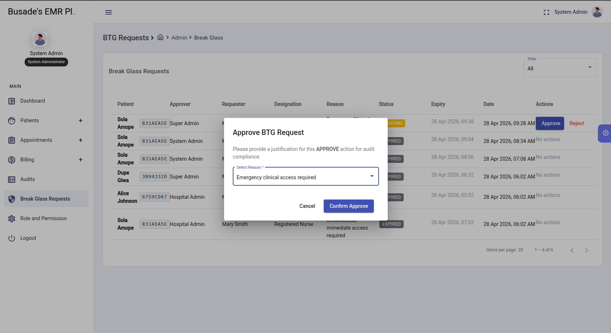

All emergency access (Break-the-Glass) requests are subject to administrative review.

Administrators can:
- ✅ Approve access requests for time-bound clinical use  
- ❌ Reject requests that lack sufficient justification  
- 🛑 Revoke previously approved access at any time before expiry  

This ensures continuous oversight and control over sensitive patient data access, even during active sessions.
---
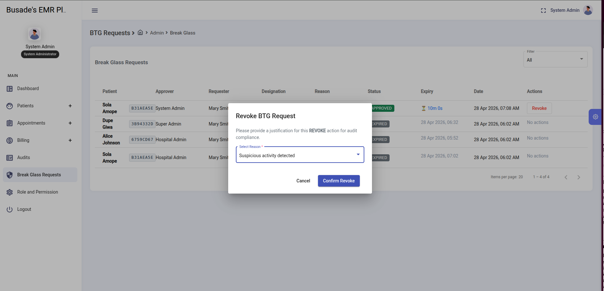
---

### 👨‍⚕️ Nurse - Temporary Access Granted
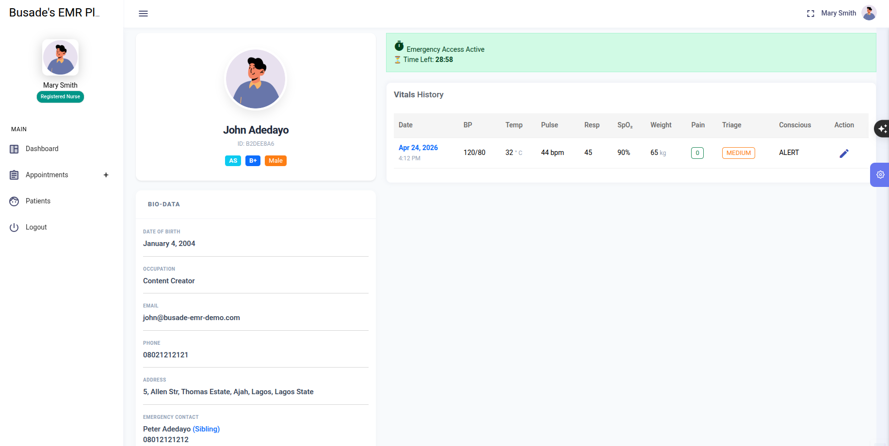

Access is time-bound and fully audited.

---

### 👁️ Doctor - Real-Time Clinical Access Monitoring
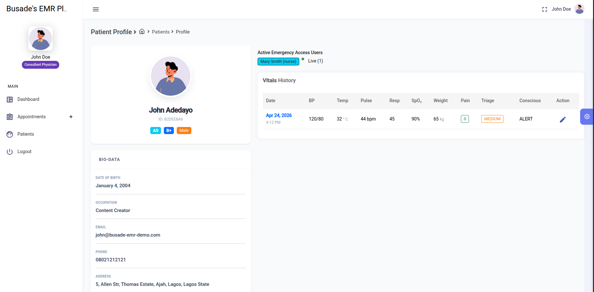

Physicians can see who is actively viewing a patient’s clinical record in real time.

This enhances patient data security and accountability by providing full visibility into concurrent access.

#### Key Features:
- Live user count indicator (e.g. "3 users viewing")
- Role-based visibility (Doctor, Admin)
- Real-time session tracking
- Supports Break-the-Glass audit compliance

This ensures transparency and prevents unauthorized or unnoticed access during sensitive clinical operations.

---

### 📜 Admin - Audit Trail
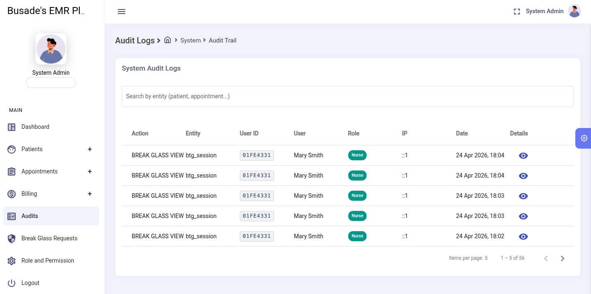

All emergency access events are logged for compliance and review.

---

## 💳 Billing — Financial Operations
### Create Bill

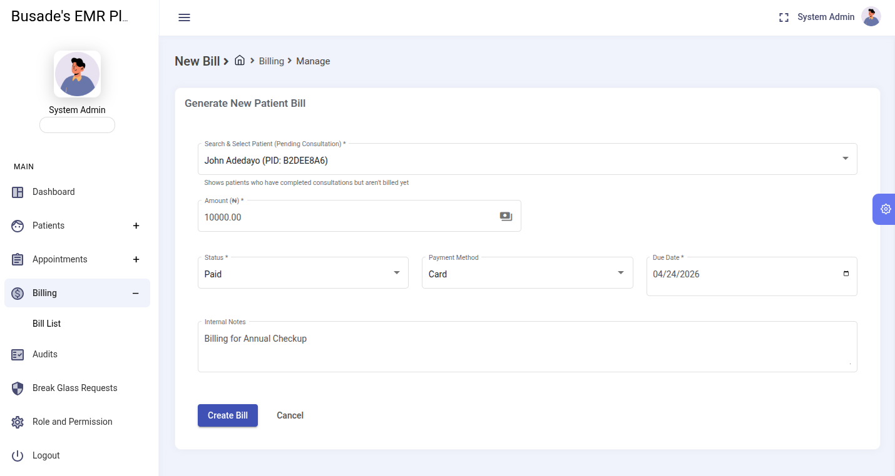

Admin manages invoices, payments, and financial records tied to patient care services. (But new role billing staff role will be added in the future)

---

### Paid Bill

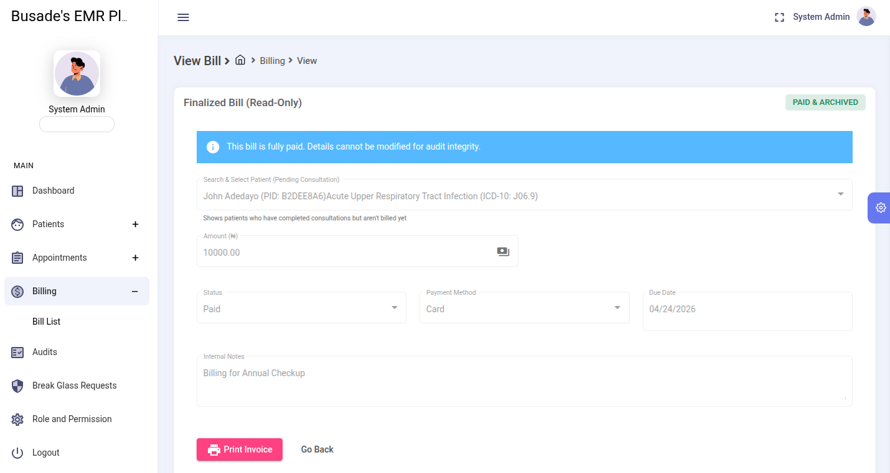

Once a bill is generated and payment is confirmed, a printable invoice/receipt is available for documentation and patient records.

### 🧾 Printable Invoice / Receipt
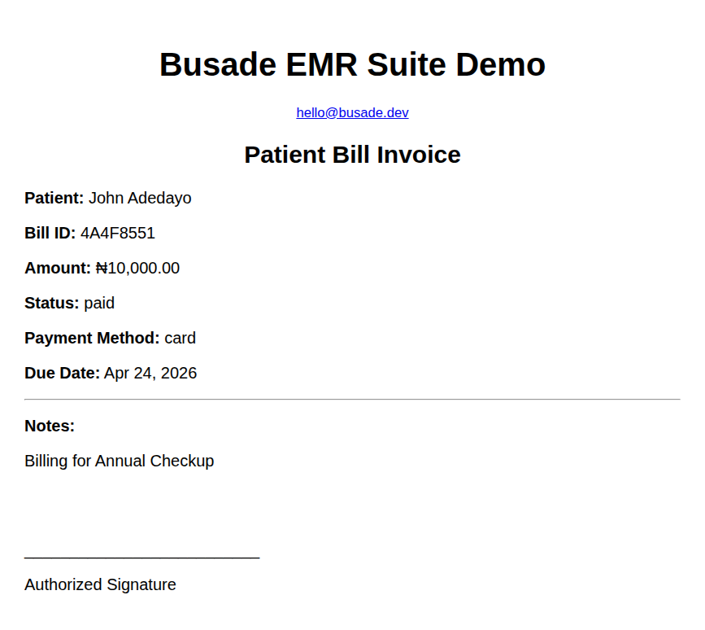

The system generates a clean, print-ready invoice that includes:
- Patient details and visit reference  
- Itemized services and charges  
- Payment status and method  
- Total amount paid  
- Date and billing staff information  

This ensures accurate financial documentation and supports both digital and physical record-keeping.

## 🔐 Admin — Access Control & Governance

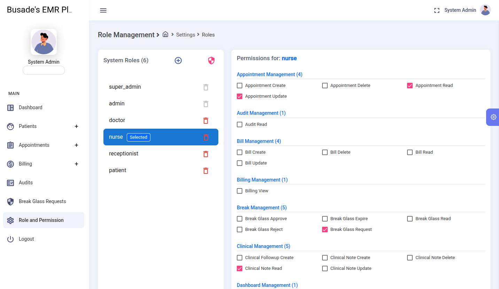

Administrators manage roles, permissions (RBAC + PBAC), and system-wide configurations to enforce security and operational policies.

---

## 🔗 API & Interoperability (FHIR-Ready Backend)

*(Swagger / API view — backend)*
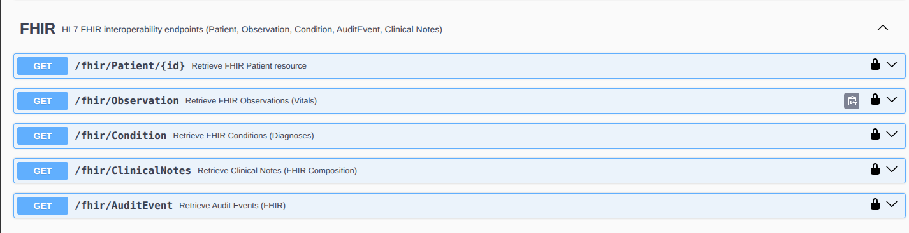

Backend exposes RESTful and FHIR-aligned endpoints via Swagger documentation, enabling interoperability with external healthcare systems.

---

# 🧩 Architecture (Frontend Design)

## Dual-Axis Architecture

- **Modules = WHO (User context)**
- **Features = WHAT (Business capability)**

---

## 🏗️ High-Level Flow

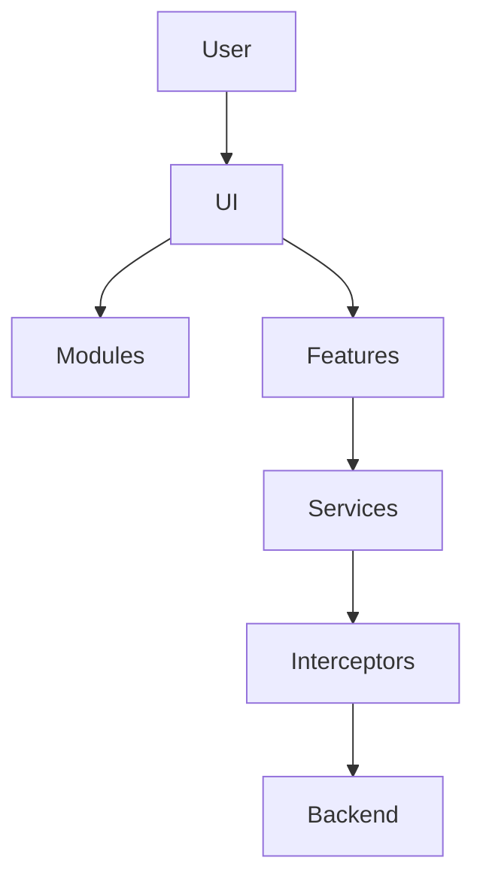
---

# 🧩 Feature Modules (WHAT)

```
features/
├── billing/
├── dashboard/
├── patient-chart/
├── personnel/
└── schedule/
```

### Example:

* Billing → financial system
* Patient-chart → clinical aggregation
* Schedule → appointment lifecycle

---

## 🔁 Role vs Feature Access

| Feature       | Admin | Doctor | Nurse | Receptionist | Patient |
| ------------- | ----- | ------ | ----- | ------------ | ------- |
| Dashboard     | ✅     | ✅      | ❌     | ✅            | ❌       |
| Patient Chart | ❌     | ✅      | ✅     | ❌            | 🔒      |
| Billing       | ✅     | ❌      | ❌     | ✅            | 🔒      |
| Schedule      | ✅     | ✅      | ❌     | ✅            | ✅       |

---

# 🔐 Security Architecture

## Flow

```
Login → JWT → Interceptor → Guard → Permission Check → Backend Validation
```

### Key Layers

* Route Guards → block unauthorized access
* Interceptors → inject JWT
* Token refresh → session continuity
* PBAC → UI-level permission control

---

# 🧠 State Management

## Approach: Reactive Service Architecture (RxJS)

* No heavy global store
* Service-driven state
* Observable-based updates

---

## Data Flow

```
UI → Service → API → Response → Observable → UI
```

---

## Key Concepts

* Stateless components
* BehaviorSubject for shared state
* DTO mapping layer
* Cross-role synchronization

---

## Real Workflow Example

```
Receptionist → Appointment
Nurse → Vitals
Doctor → Clinical Note
Billing → Invoice
Admin → Oversight
```

---

# 📁 Project Structure

```
src/app/
├── core/        # Guards, interceptors, base services
├── shared/      # Reusable UI + utilities
├── modules/     # Role-based modules (WHO)
├── features/    # Business features (WHAT)
├── layouts/     # UI shells
```

---

# ⚙️ Running the App

```bash
npm install
npm start
```

[http://localhost:4200](http://localhost:4200)

---

# 🚀 Roadmap

* Angular 17+
* Signals-based state
* Performance optimization
* Micro-frontend readiness

---

# 👤 About the Engineer

**Busade Adedayo**
*Senior Software Engineer / Solution Architect (Healthcare Systems)*

* 5-8+ years of experience building and scaling production-grade **Electronic Medical Record (EMR)** systems
Led architecture and development of domain-driven, modular healthcare platforms used in real clinical workflows
Strong focus on:
✔  Clinical workflow digitization (SOAP notes, vitals, prescriptions)
✔ System architecture & scalability (DDD, modular monolith design)
✔ Healthcare interoperability (FHIR R4 standards)
Security & compliance (RBAC, PBAC, audit logging, BTG - emergency access)
✔ Experienced in designing enterprise backend systems with observability, logging, and monitoring layers
✔ AWS Cloud Practitioner certified | Preparing for AWS Solutions Architect - Associate
✔ **Passionate about building global-standard healthcare infrastructure from Africa for global markets*

---

# 📜 License

MIT © 2026 - Busade Adedayo

---
# 🚀 Final Note

> This project demonstrates **how real healthcare systems are designed — not just built.**

It combines:

* Clinical workflows
* Emergency access (BTG)
* Enterprise security (RBAC + PBAC)
* Reactive frontend architecture
* Backend-integrated intelligence

---

**This is not a UI demo — it is a production-grade clinical system frontend.**

---
